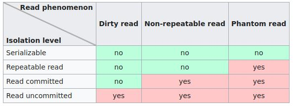
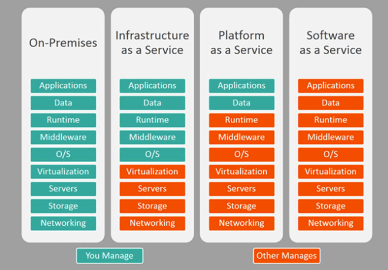

# Key concepts of Systems Design

Cheatsheets for Systems Design, Distributed Systems, DevOps and DBMS.

<!-- [:arrow_down: Tags legend](#tags-legend) at the end of the page. -->

<!-- -  by  ( _:movie_camera:_ ) -->

## CAP Theorem

## Horizontal / Vertical scaling

## Sharding ~ database partitiioning

## Resilience design patterns

## Isolation levels vs read phenomena

## IaaS vs PaaS vs SaaS

## Benefits
<!-- https://mermaid.live/edit#pako:eNqtVcFq20AQ_ZVBUGhFDunVlEIhTU-hJe6p-DJejaXFqx11d2VXCfn3vlXsRHIcconBoNnVzrz35u3ovjBaSbEoWuurlruVJwqq6dNSXZ-s-o95hehnl2xr7zgvkW4IkTzu5F9Zfquts2koyy_r8LXk9RhRUjIN-1ooNUJxiEla2tvUaJ9I_qXAVInjIZbTXD-crtlREDbNMaExEmPO13Co9hyE9o01DdlIlY0p2HWfpCJ2jnQnYay31-Cq8jz-ILFTH-0j0Gn1azV9JLw1aB9I954QJ20llDOUSyBBRTHqtT0SBxupUcTXufo2V2rZ-oT__LCYPjzrdeZYFzSJyUtvaXPmcOJtDk3WCeFRs1e0MBrTtMYvHjL_Slr21aFIhzWOWROq9W0dIhYzgtyGnH5sOinC8CRnfAVOtHczay0Nu4OhXtrLegMtImgGAD48o7noHRxDGyyzH6i2O_GjPE65Qk98D6sMMyLfHcdkzTuW4R5Ewcu8qPU-1-VUub8gdeLmW3F2Lh6MtX4q2HA61sFN0k7CmAwOQ-upFUmRjITsX8ImeEI6A2wJ-3DVnNSO7UmncMYI7F_LcWhMqc1LznJd9WGeqdE9OYWlDmcN-4xiQBcyQyez49fcu0S_1SE78L7UuQuCViVi2gB0j3uSCTe8E_p8efmBeMplmvnmcJ3n6EaPg-FWpDv6_gD0NYa3EpFBzqILuE15im2CthOI2Xw2wqWYReenSXFR4GZh5FQY6ff5nVUBLJjVxQKPztZNWhUr_4AXszuXgzfFIoVeLoq-qzjJleU6cFssNuwiVjv2f1SfY6ls0nDz-NEYvx0P_wHrCxyx -->

<!-- ## Tags legend -->
<!-- - ( _:movie_camera:_ ) - video material -->
<!-- - ( _short_ ) - short overview -->
