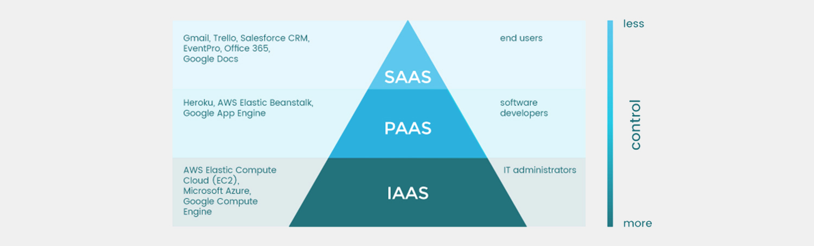

# Key concepts of Systems Design

Cheatsheets for Systems Design, Distributed Systems, DevOps and DBMS.

<!-- [:arrow_down: Tags legend](#tags-legend) at the end of the page. -->

<!-- -  by  ( _:movie_camera:_ ) -->

## CAP Theorem

## Horizontal / Vertical scaling

## Sharding ~ database partitiioning

## Resilience design patterns

## IaaS vs PaaS vs SaaS

<!-- ## Tags legend -->
<!-- - ( _:movie_camera:_ ) - video material -->
<!-- - ( _short_ ) - short overview -->
