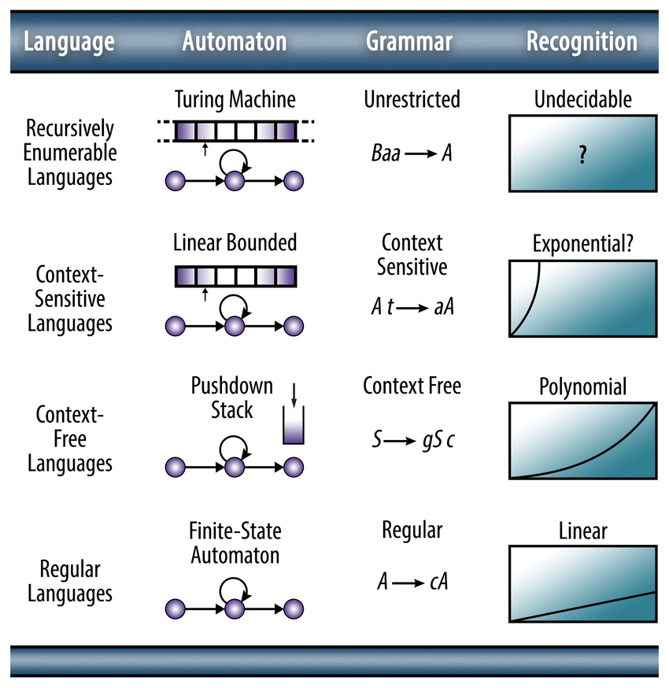

# Parsing Theory Cheatsheet

Cheatsheets for Parsing Theory.

<!-- [:arrow_down: Tags legend](#tags-legend) at the end of the page. -->

<!-- - []() by []() ( _:movie_camera:_ ) -->

## Chomsky's Hierarchy of Grammars



## Ambiguity in CFG

```text

Context Free Grammar: E → E + E | E × E | id

Left Most Derivation:     Right Most Derivation:    Parse Tree Derivation:

 E ⇒ E + E                 E ⇒ E + E                    E
   ⇒ id + E                  ⇒ E + E × E               / \
   ⇒ id + E x E              ⇒ E + E × id             E + E
   ⇒ id + id x E             ⇒ E + id × id            |   /\
   ⇒ id + id x id            ⇒ id + id × id          id  E * E
                                                          |   |
                                                         id   id

 E ⇒ E x E                 E ⇒ E x E                     E
   ⇒ E + E x E               ⇒ E x id                   / \
   ⇒ id + E x E              ⇒ E + E x id              E * E
   ⇒ id + id x E             ⇒ E + id x id            / \  |
   ⇒ id + id x id            ⇒ id + id x id          E + E id
                                                      |   |
                                                     id  id
```

## Left Recursion / Right Recursion

```text

Left Recursion ~ Left Associativity

A → Aα | β

  A                  A                   A
  |                 / \                 / \
  β                A   α               A   α
                   |                  / \
                   β                 A   α
                                     |
                                     β

Right Recursion ~ Right Associativity

A → αA | β

  A                  A                  A
  |                 / \                / \
  β                α   A              α   A
                       |                 / \
                       β                α   A
                                            |
                                            β

```
