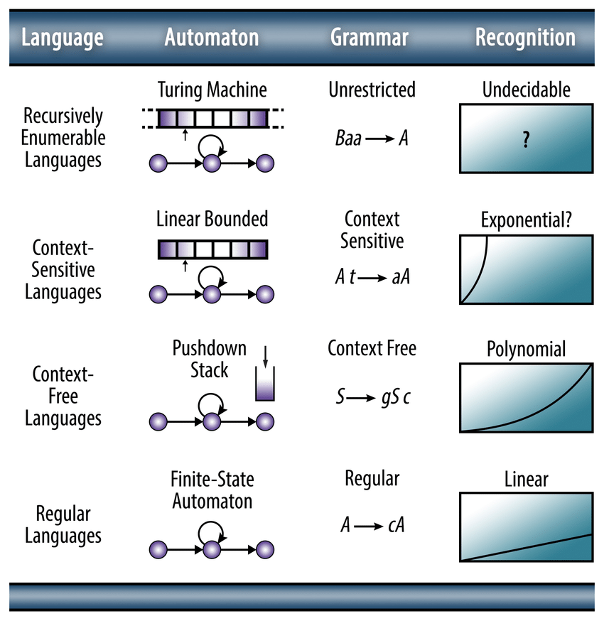

# Key concepts of Parsing Theory

Key concepts of Parsing Theory.

<!-- [:arrow_down: Tags legend](#tags-legend) at the end of the page. -->

<!-- - []() by []() ( _:movie_camera:_ ) -->

## Computational Models

Theoretical frameworks used to study and understand the nature of computation.

Computational models provide a formal structure for analyzing the capabilities and limitations of different computational processes. They explore fundamental questions about what can be computed, the resources required for computation, and the complexity of computational problems. These models serve as the foundation for understanding various aspects of computation, such as decidability, expressiveness, and efficiency.

### Classic Computational Models

- **Turing Machines**: Model general computation and are capable of simulating any algorithmic process.
- **Finite Automata**: Used for simpler computational tasks and recognize regular languages.
- **Pushdown Automata**: Extend finite automata with a stack to recognize context-free languages.
- **Lambda Calculus**: Provides a formal system for expressing computation through function abstraction and application.
- **Register Machines**: Use a finite number of registers to perform computations.
- **Cellular Automata**: Consist of a grid of cells, each in one of a finite number of states, evolving over discrete time steps according to a set of rules.
- **Markov Algorithms**: A string rewriting system that provides a model of computation based on the application of rules to strings.
- **Petri Nets**: A mathematical modeling language used for the description of distributed systems.

Each of these models offers unique insights into different aspects of computation, and they are often used to compare the computational power and efficiency of various algorithms and systems.

## Abstract Machines

Simplified, theoretical representations of computer systems used to analyze algorithms and programming languages.

Abstract machines are a subset of computational models that focus on simulating the behavior of a computer or a specific computational process. They provide a high-level abstraction of how computations are executed, often ignoring the complexities of actual hardware. Abstract machines are used to study the execution of algorithms, the semantics of programming languages, and the efficiency of computational processes. Examples include the Turing machine, which is a universal model of computation, and the finite state machine, which models systems with a limited number of states. These machines are instrumental in understanding the practical implementation of computational theories.

The key difference between computational models and abstract machines lies in their scope and application. **Computational models** are broad theoretical constructs that explore the fundamental principles and limits of computation, often focusing on the theoretical analysis of what can be computed. In contrast, **abstract machines** are specific instances of computational models that simulate the execution of computations, providing a practical framework for analyzing algorithms and programming languages. While computational models address the "what" and "why" of computation, abstract machines focus on the "how" of executing computational processes.

## Computational Models > Finite Automata

Abstract machines used to recognize regular languages with a finite number of states.

- **Memory**: Limited to the current state (no additional memory).
- **Control Structure**: Finite set of states and transitions.
- **Input/Output**: Processes input symbols to determine acceptance.
- **Computation**: Based on state transitions for each input symbol.
- **Universality**: Limited to recognizing regular languages.
- **Equivalence**: Equivalent to regular expressions.

## Computational Models > Pushdown Automata

Extend finite automata with a stack to recognize context-free languages.

- **Memory**: Finite states plus a stack for additional memory.
- **Control Structure**: Finite set of states and stack operations.
- **Input/Output**: Reads input symbols and manipulates the stack.
- **Computation**: Uses state transitions and stack operations.
- **Universality**: Recognizes context-free languages, not universal.
- **Equivalence**: Equivalent to context-free grammars.

## Computational Models > Turing Machine

A theoretical model with an infinite tape and a set of rules for reading, writing, and moving the tape head.

- **Memory**: Infinite tape providing unlimited memory.
- **Control Structure**: Finite set of states and a transition function.
- **Input/Output**: Reads and writes symbols on the tape.
- **Computation**: Defined by state transitions and tape operations.
- **Universality**: Capable of simulating any other computational model.
- **Equivalence**: Equivalent to lambda calculus, register machines, and other universal models.

## Computational Models > Lambda Calculus

A formal system for expressing computation through function abstraction and application.

- **Memory**: Abstract representation through variables and functions.
- **Control Structure**: Function abstraction and application.
- **Input/Output**: Function application and variable substitution.
- **Computation**: Based on function evaluation and substitution.
- **Universality**: Equivalent to Turing machines in computational power.
- **Equivalence**: Equivalent to Turing machines and other universal models.

## Computational Models > Register Machines

Abstract machines using a finite number of registers to perform computations.

- **Memory**: Finite number of registers for storing data.
- **Control Structure**: Instructions for manipulating register values.
- **Input/Output**: Operates on data stored in registers.
- **Computation**: Defined by a sequence of instructions.
- **Universality**: Capable of simulating any Turing machine.
- **Equivalence**: Equivalent to Turing machines and other universal models.



##### Type 0: **Unrestricted Grammar**

- **Production Rule**: (Σ ∪ N)+ → (Σ ∪ N)*
  - No restrictions on production rules.
  - Alternatively: α → β
  - α is a string of terminals and/or non-terminals with at least one non-terminal
  - β is a string of terminals and/or non-terminals
- **Generative Power**: Can generate any language that can be recognized by a Turing machine.
- **Computational Models**: Recognized by Turing machines.
- **Memory**: Unlimited, allowing for complex computations and context sensitivity.
- **Recognition Complexity**: Generally undecidable, as it can require arbitrary computation.
- **Limitations**: Computationally expensive and difficult to implement for practical use.

##### Type 1: **Context-Sensitive Grammar** ~ **CSG**
- **Production Rule**: αAβ → αγβ
  - A is a non-terminal
  - α, β, γ are strings of terminals and/or non-terminals
- **Generative Power**: Can generate context-sensitive languages.
- **Computational Models**: Recognized by linear bounded automata.
- **Memory**: Limited but sufficient for context-sensitive rules.
- **Recognition Complexity**: Polynomial time, as it is constrained by the linear bounded automaton.
- **Limitations**: More complex than CFGs, making them harder to parse and implement.

##### Type 2: **Context-Free Grammar** ~ **CFG**
- **Production Rule**: N → (Σ ∪ N)*
  - Non-terminals are replaced by combinations of terminals and non-terminals
  - Alternatively: A → γ
  - A is a non-terminal
  - γ is a string of terminals and/or non-terminals
- **Generative Power**: Can generate context-free languages.
- **Computational Models**: Recognized by pushdown automata.
- **Memory**: Uses a stack, allowing for nested and recursive structures.
- **Recognition Complexity**: Generally cubic time, O(n^3), but can be optimized to O(n^2) or O(n) for specific grammars.
- **Limitations**: Cannot handle context-sensitive languages or enforce certain constraints.

##### Type 3: **Regular Grammar**
- **Production Rule**: N → Σ * N?
  - Production rules replace non-terminals with a terminal followed by an optional non-terminal.
  - Can be either Right Linear Grammar (RLG) or Left Linear Grammar (LLG).
  - **Right Linear Grammar (RLG)**: A → aB or A → a
    - A and B are non-terminals
    - a is a terminal
  - **Left Linear Grammar (LLG)**: A → Ba or A → a
    - A and B are non-terminals
    - a is a terminal
- **Generative Power**: Can generate regular languages.
- **Computational Models**: Recognized by finite automata.
- **Memory**: Limited to current state, no additional memory or stack.
- **Recognition Complexity**: Linear time, O(n), as it is processed by finite automata.
- **Limitations**: Cannot handle nested or recursive structures, counting, or context sensitivity.

## RLG ~ Right Linear Grammar

A type of regular grammar where production rules are of the form A → aB or A → a, with non-terminals appearing on the right side of the terminal. Where A and B are non-terminals and a is a terminal.

## LLG ~ Left Linear Grammar

A type of regular grammar where production rules are of the form A → Ba or A → a, with non-terminals appearing on the left side of the terminal. Where A and B are non-terminals and a is a terminal.

## Left Most Derivative ~ Leftmost Derivation

A process in formal grammar where the leftmost non-terminal in a string is replaced first during each step of the derivation sequence. This concept is particularly relevant to context-free grammars (CFGs) and is commonly used in parsing techniques like LL parsers, which read input from left to right and construct a leftmost derivation of the sentence.

## Right Most Derivative ~ Rightmost Derivation

A process in formal grammar where the rightmost non-terminal in a string is replaced first during each step of the derivation sequence. This is especially relevant to context-free grammars (CFGs) and is used in parsing techniques like LR parsers, which read input from left to right and construct a rightmost derivation in reverse.

## Context-Free Grammar / Regular Grammar

**Regular Grammar**

- **Definition**: Regular grammars have rules where a non-terminal is replaced by a terminal, optionally followed by another non-terminal.
- **Expressive Power**: Less powerful than CFGs; cannot handle nested structures.
- **Parsing**: Uses simple and efficient algorithms like finite state machines or regular expression engines.
- **Applications**: Used in lexical analysis to define the structure of tokens in programming languages and in text processing tools like grep and sed.

**Context-Free Grammar (CFG)**

- **Definition**: CFGs have production rules where a single non-terminal is replaced by a string of terminals and/or non-terminals.
- **Expressive Power**: More powerful than regular grammars; can describe languages with nested structures, such as balanced parentheses.
- **Parsing**: Requires more complex parsing techniques, such as LL, LR, or CYK parsers, to handle recursive and nested structures.
- **Applications**: Widely used in the design of programming languages and compilers, where the syntax of the language is often context-free.

**Example of CFG**: Balanced Parentheses
  - Grammar:
    - S → empty string
    - S → (S)
    - S → SS

This CFG can generate all strings of balanced parentheses, a task that regular grammars cannot accomplish due to their inability to handle nested or recursive patterns.

## Ambiguity in CFG

Ambiguity in grammar occurs when a single string can be generated by a grammar in more than one distinct way, resulting in multiple parse trees or derivations. This means that the grammar allows for more than one interpretation of the structure of the string.

Ambiguity is particularly relevant to context-free grammars (CFGs) because they are often used to define the syntax of programming languages, where unambiguous interpretation is crucial. However, ambiguity can also occur in other types of grammars, but it is most commonly discussed in the context of CFGs due to their widespread use in language parsing and compiler design.

```text

Context Free Grammar: E → E + E | E × E | id

Left Most Derivation:     Right Most Derivation:    Parse Tree Derivation:

 E ⇒ E + E                 E ⇒ E + E                    E
   ⇒ id + E                  ⇒ E + E × E               / \
   ⇒ id + E x E              ⇒ E + E × id             E + E
   ⇒ id + id x E             ⇒ E + id × id            |   /\
   ⇒ id + id x id            ⇒ id + id × id          id  E * E
                                                          |   |
                                                         id   id

 E ⇒ E x E                 E ⇒ E x E                     E
   ⇒ E + E x E               ⇒ E x id                   / \
   ⇒ id + E x E              ⇒ E + E x id              E * E
   ⇒ id + id x E             ⇒ E + id x id            / \  |
   ⇒ id + id x id            ⇒ id + id x id          E + E id
                                                      |   |
                                                     id  id
```

## Parsing Expression Grammar ~ PEG

A formal grammar framework used to describe the syntax of languages, offering an alternative to Context-Free Grammars (CFGs) with unique features.

## PEG / CFG

PEGs offer a powerful alternative to CFGs for defining and implementing parsers, especially when deterministic parsing is required.

PEGs differ from CFGs in that they use a deterministic choice operator, which eliminates ambiguity by always selecting the first successful match in a sequence of alternatives. This makes PEGs particularly useful for programming language parsers, as they can handle complex syntax rules without ambiguity. PEGs are often implemented using **packrat parsers**, which provide linear-time parsing by caching intermediate results.

PEGs are well-suited for tasks where precise control over parsing decisions is required, and they allow for more straightforward implementation of certain language features compared to CFGs.

- **Determinism**: PEGs use ordered choice, ensuring deterministic parsing by selecting the first successful match, which can lead to the prefix capture problem where earlier alternatives capture input, requiring careful rule ordering. CFGs allow ambiguity with multiple parse trees for the same input string.
- **Parsing Strategy**: PEGs typically use packrat parsers for linear-time parsing by caching results, whereas CFGs use strategies like LL, LR, or CYK, which may involve backtracking or complex table-driven methods.
- **Expressive Power**: PEGs can express all deterministic context-free languages and some languages CFGs cannot due to ambiguity, while CFGs can express a broader range of context-free languages, including ambiguous ones.
- **Grammar**: PEGs include constructs like sequence, ordered choice, repetition, and lookahead predicates, whereas CFGs use production rules that map non-terminals to strings of terminals and non-terminals.
- **Complexity**: PEGs achieve linear-time complexity for deterministic parsing with packrat parsing, while CFGs' best parsing algorithms, like CYK, have a time complexity of cubic time, though deterministic parts of CFGs can run in linear time.
- **Semantics**: PEGs have intensional semantics, where the language is defined by the sentences recognized, similar to top-down recursive-descent parsers. CFGs have extensional semantics, where the language is the set of sentences obtained by derivation.

###### Origin

The term "Parsing Expression Grammar" was introduced by Bryan Ford in his 2004 paper, proposing PEGs as an alternative to CFGs for deterministic and unambiguous syntax specification.

###### Example

A simple PEG for arithmetic expressions:

```
Expression <- Term (('+' / '-') Term)*
Term       <- Factor (('*' / '/') Factor)*
Factor     <- Number / '(' Expression ')'
Number     <- [0-9]+
```

## PEG - Key Characteristics

1. **Deterministic Parsing**: PEGs are designed to be deterministic, eliminating ambiguity through ordered choice, where the first matching alternative is selected.

2. **Syntax**: Uses constructs like sequence, ordered choice, repetition, and lookahead predicates (not and and) to define grammar rules.

3. **Expressive Power**: Can express all deterministic context-free languages and some languages CFGs cannot due to ambiguity, but not all context-sensitive languages.

4. **Applications**: Used in parsing programming languages, data formats, and structured text, particularly where deterministic parsing is desired.

5. **Advantages**: Provides a clear, concise way to define grammars without ambiguity, allowing for straightforward parsing algorithms without backtracking.

## Left Recursion / Right Recursion

```text

Left Recursion ~ Left Associativity

A → Aα | β

  A                  A                   A
  |                 / \                 / \
  β                A   α               A   α
                   |                  / \
                   β                 A   α
                                     |
                                     β

Right Recursion ~ Right Associativity

A → αA | β

  A                  A                  A
  |                 / \                / \
  β                α   A              α   A
                       |                 / \
                       β                α   A
                                            |
                                            β

```

## Elimination of Left Recursion

If left recursion is indirect (involving multiple non-terminals), the grammar must first be transformed to remove indirect recursion by reordering or rewriting rules.

Direct left recursion occurs when a non-terminal directly calls itself on the left side of its production. By eliminating left recursion, the grammar becomes suitable for top-down parsing methods, which require non-left-recursive ( in case of parsing from left to right ) grammars to function correctly.

```text

Original Grammar Rule:
  A → Aα | β

Transformed Grammar to Remove Left Recursion:
  A → βA'
  A' → αA' | ε
```

## Left Refactoring

Left factoring is a technique used to transform a grammar to convert it into deteministic one to make it suitable for predictive parsing, such as LL parsers.

It is applied when a grammar has production rules with common prefixes, which can cause ambiguity in deciding which production to use during parsing. Left factoring helps eliminate this ambiguity by restructuring the grammar. But bear in mind that deterministic grammar does not guarantee unambiguous.

Left Factoring Process

```text
  Identify Common Prefixes:
    Look for non-terminals with multiple productions that share a common prefix. For example, consider the productions:
      A → αβ₁
      A → αβ₂

  Factor Out the Common Prefix:
    Introduce a new non-terminal to represent the common prefix and rewrite the productions. For the example above:
      Introduce a new non-terminal A'.
      Rewrite the productions as:
        A → αA'
        A' → β₁ | β₂

  Example

    Original Grammar:
      A → aAB | aBc | aAc

    Intermidiary Step:
      A → aA'
      A' → AB | Ac | Bc

    Refactored Grammar:
      A → aA'
      A' → AA'' | Bc
      A'' → B | c

  Ambigious Example

    Original Grammar:
      S → iEtS | iEtSeS | a
      E → b

    Refactored Grammar:
      S → iEtSS' | a
      S' → ε | eS
      E → b

  Example

    Original Grammar:
      S → aSSbS | aSaSb | abb | b

    Intermidiary Step:
      S → aS' | b
      S' → SSbS | SaSb | bb

    Refactored Grammar:
      S → aS' | b
      S' → SS'' | bb
      S'' → SbS | aSb

  Example

    Original Grammar:
      S → bSSaaS | bSSaSb | bSb | a

    Intermidiary Step:
      S → bS' | a
      S' → SaaS | SaSb | b

    Refactored Grammar:
      S → bSS' | a
      S' → SaS'' | b
      S'' → aS | Sb

  Example

    Original Grammar:
      S → a | ab | abc | abcd

    Refactored Grammar:
      S → aS'
      S' → bS'' | ε
      S'' → cS''' | ε
      S''' → d | ε

```

## First, Follow Functions

The First function helps determine which terminal symbols can appear at the beginning of strings derived from a given grammar symbol.

The Follow function determines which terminal symbols can appear immediately after a non-terminal in some "sentential" form.

> Example

| Production | FIRST     | FOLLOW   |
|------------|-----------|----------|
| S → ABCDE  | {a, b, c} | {$}      |
| A → a      | {a, ε}    | {b, c}   |
| B → b      | {b, ε}    | {c}      |
| C → c      | {c}       | {d, e, $}|
| D → d      | {d, ε}    | {e, $}   |
| E → e      | {e, ε}    | {$}      |

> Example

| Production | FIRST    | FOLLOW   |
|------------|----------|----------|
| S → aBDh   | {a}      | {$}      |
| B → c      | {c}      | {g, f, h}|
| C → bC ε   | {b, ε}   | {g, f, h}|
| D → EF     | {g, f, ε}| {g, f, h}|
| E → g ε    | {g, ε}   | {f, h}   |
| F → f ε    | {f, ε}   | {h}      |
