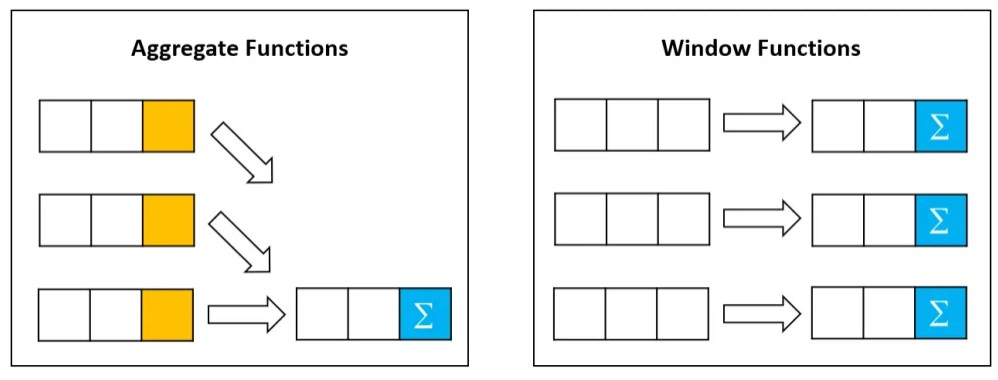
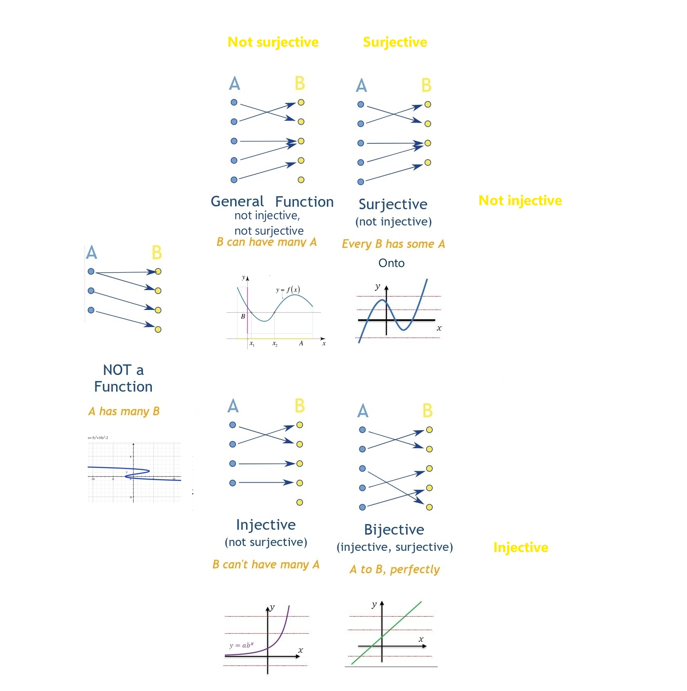
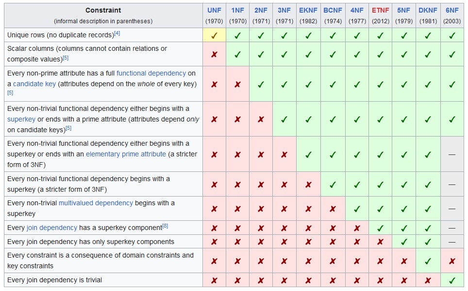

# Cheat Sheets

## SQL Join

## Other SQL Join

## SQL Isolation Levels

## SQL : Aggregate vs Window Functions

## Normalization Steps

## Transitive vs Full Dependencies

## Functions Mapping

## All Normal Forms

