# Cheat sheets

### SQL Join

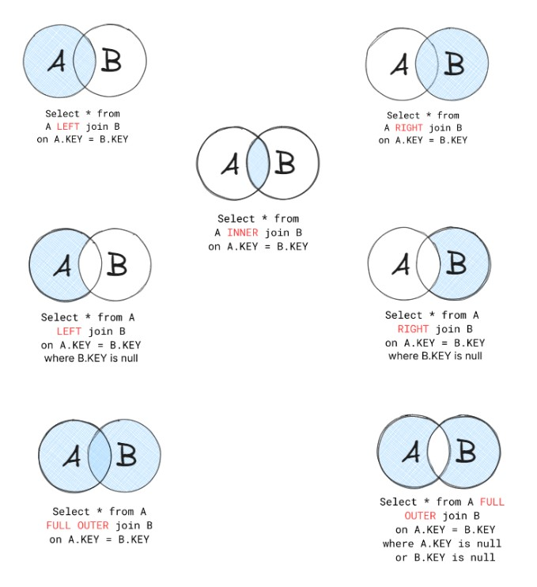

### Other SQL Join

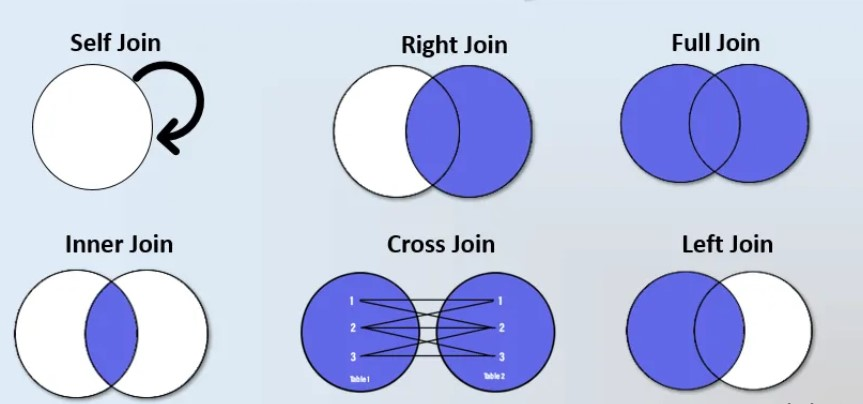

### SQL Isolation Levels

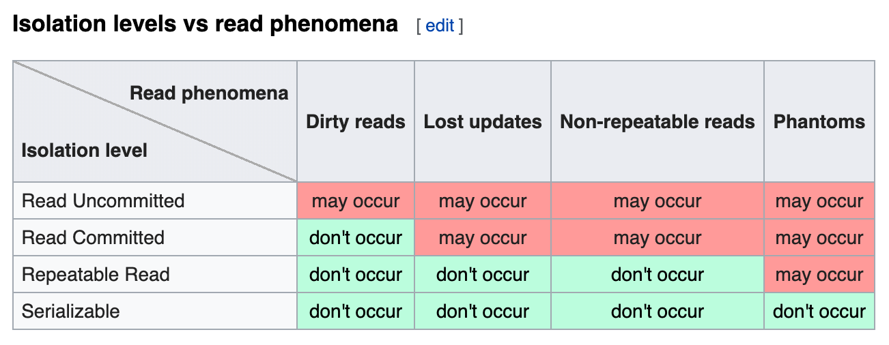

### Normalization Steps

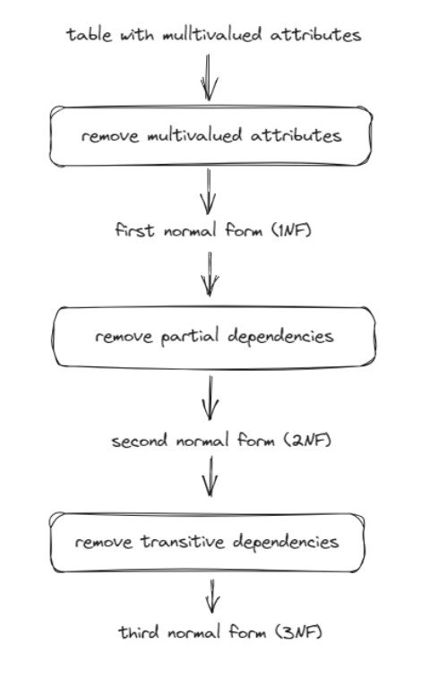

### Transitive vs Full Dependencies

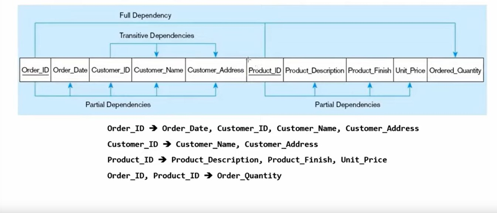

### ERD: Chens Notation

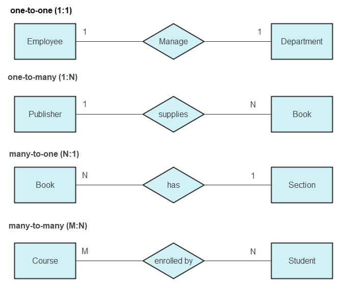

### ERD: ISO Notation

### ERD: UML Notation

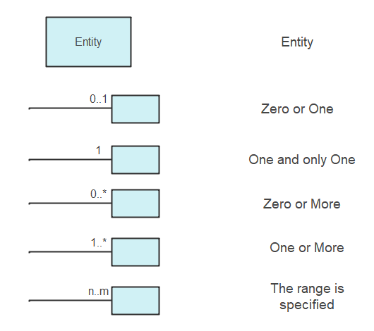

### ERD: Crows Food Notation

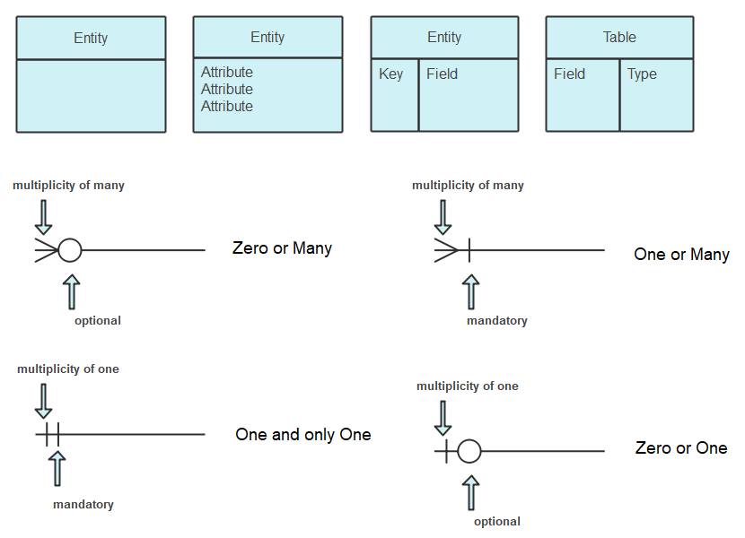
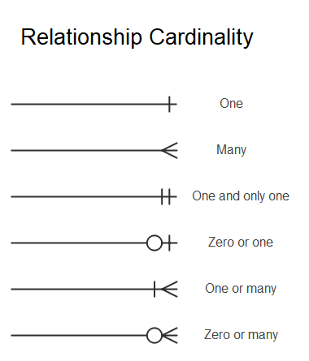

### ERD: Barkers Notation

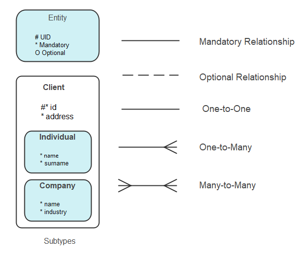
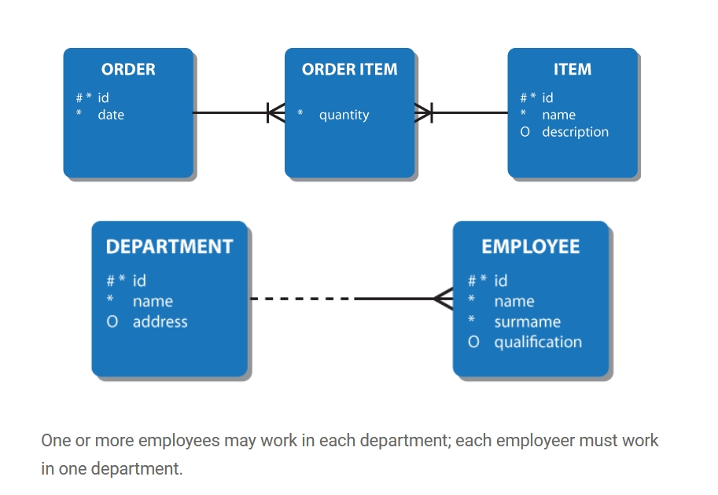
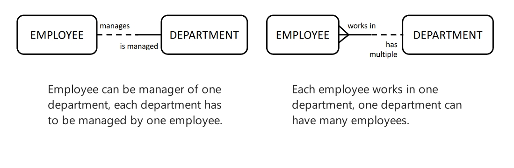

### ERD: Bachmans Notation

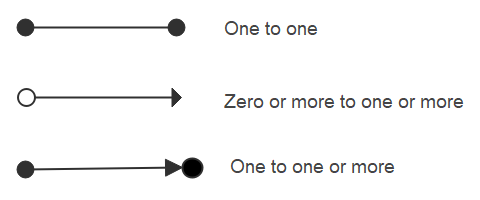

### Many to Many in Relational DB

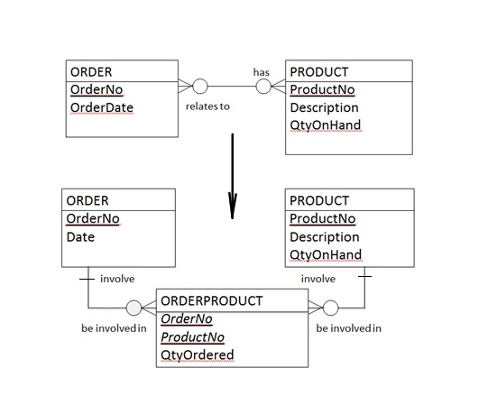

### Self-Referential Structure

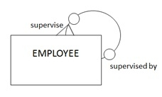

### Self-Referential Relationship ( Crows Style )

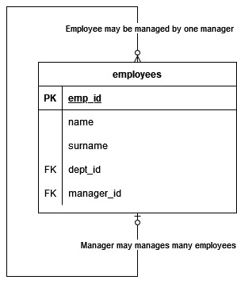

### Entity Relationship Diagram ( Crows Style )

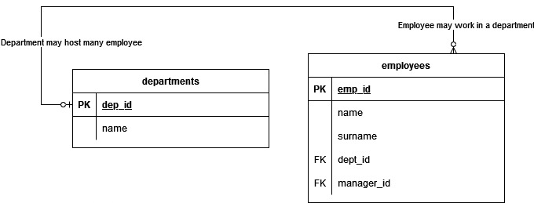

### Entity Relationship Diagram ( UML Style )

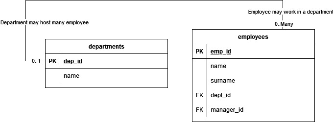
