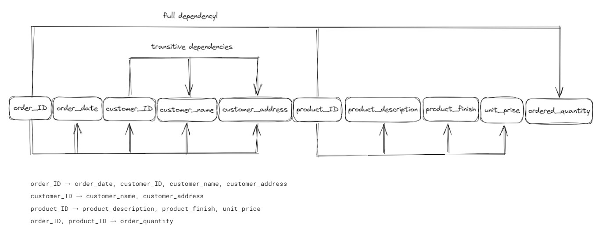

# Cheat sheets

### SQL Join

### Other SQL Join

### SQL Isolation Levels

### Normalization Steps

### Transitive vs Full Dependencies

### ERD: Chens Notation

### ERD: ISO Notation

### ERD: UML Notation

### ERD: Crows Food Notation

### ERD: Barkers Notation

### ERD: Bachmans Notation

### Many to Many in Relational DB

### Self-Referential Structure

### Self-Referential Relationship ( Crows Style )

### Entity Relationship Diagram ( Crows Style )

### Entity Relationship Diagram ( UML Style )

