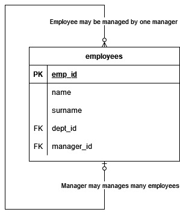
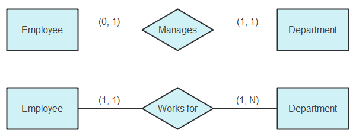
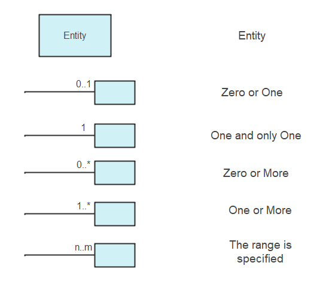
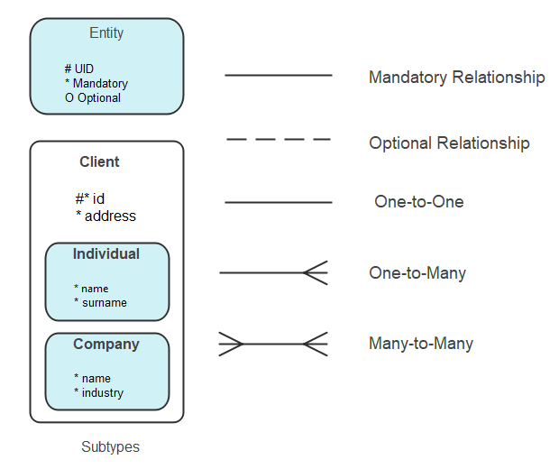
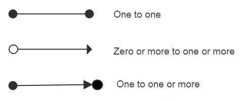

# ERD Cheat Sheets

## Many to Many in Relational DB

## Self-Referential Relationship ( Crows Foot Style )

## Entity Relationship Diagram ( Crows Foot Style )

## Entity Relationship Diagram ( UML Style )

## ERD: Chens Notation

## ERD: ISO Notation

## ERD: UML Notation

## ERD: Crows Food Notation

## ERD: Barkers Notation

## ERD: Bachmans Notation

