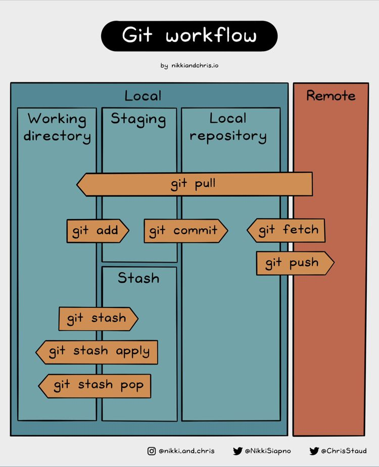

# Cheat sheets

#### rebase

```shell
git rebase master
git rebase master feature1

# attach to master current branch ( feature1 ) moving its pointer
# before                              after
# A---B---C---F---G (master)          A---B---C---F---G (master)
#          \                                           \
#           D---E (HEAD feature1)                       D'---E' (HEAD feature1)
```

#### rebase without moving branch pointer

```shell
git rebase master G
git rebase master feature1~0

# attach to master current branch ( feature1 ) without moving its pointer
# before                              after
# A---B---C---F---G (master)          A---B---C---F---G (master)
#          \                                  |        \
#          D---E (HEAD feature1)              |         D'---E' (HEAD)
#                                             D---E (feature1)
```

#### rebase selective moving branch pointer

```shell
git rebase --onto F D
git rebase --onto F D feature1

# attach to F what goes after D and moving current branch ( feature1 ) pointer
# before                                    after
# A---B---C---F---G (branch)                A---B---C---F---G (branch)
#          \                                             \
#           D---E---H---I (HEAD feature1)                 E'---H'---I' (HEAD feature1)
```

#### rebase selective without moving branch pointer

```shell
git rebase --onto F D H
git rebase --onto F D HEAD

# attach to F what goes after D stopping at H
# before                                    after
# A---B---C---F---G (branch)                A---B---C---F---G (branch)
#          \                                        |    \
#           D---E---H---I (HEAD feature1)           |     E'---H' (HEAD)
#                                                   \
#                                                   D---E---H---I (feature1)
```

#### commits drop

```shell
git rebase --onto B D
git rebase --onto B D branch1

# attach to B what goes after D moving branch pointer
# before                                 after
# A---B---C---D---E---F (HEAD branch)    A---B---E'---F' (HEAD branch)
```

### git areas


