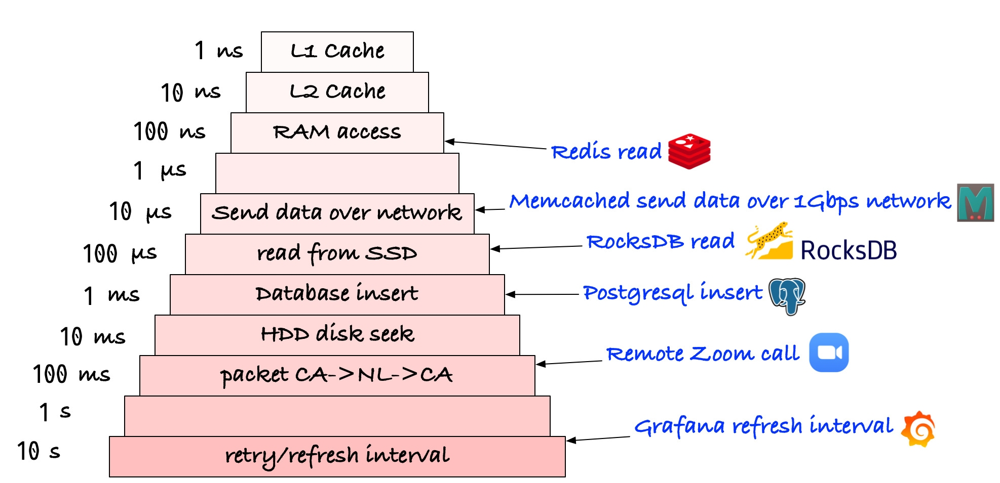
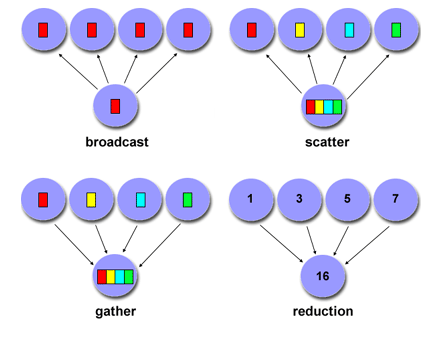
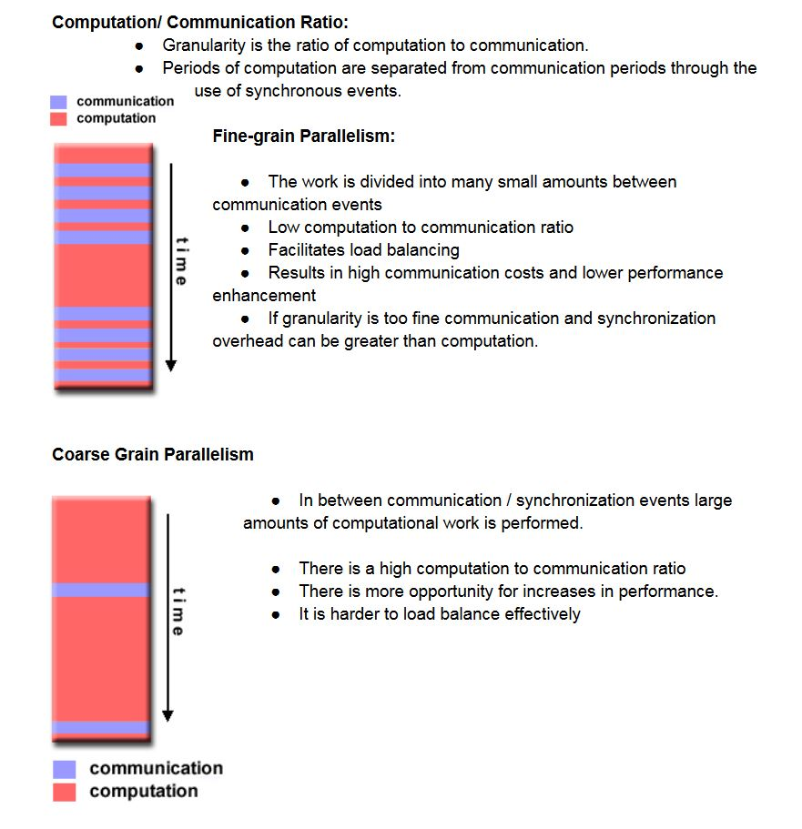

# Key concepts of HPC

Cheatsheets for HPC and parallel computing.

<!-- [:arrow_down: Tags legend](#tags-legend) at the end of the page. -->

<!-- -  by  ( _:movie_camera:_ ) -->

##### Asynchronous vs Multithreading

##### Latencies

##### Collective Communication

##### Granularity

##### CPU vs GPU

<!-- #### Tags legend -->
<!-- - ( _:movie_camera:_ ) - video material -->
<!-- - ( _short_ ) - short overview -->
