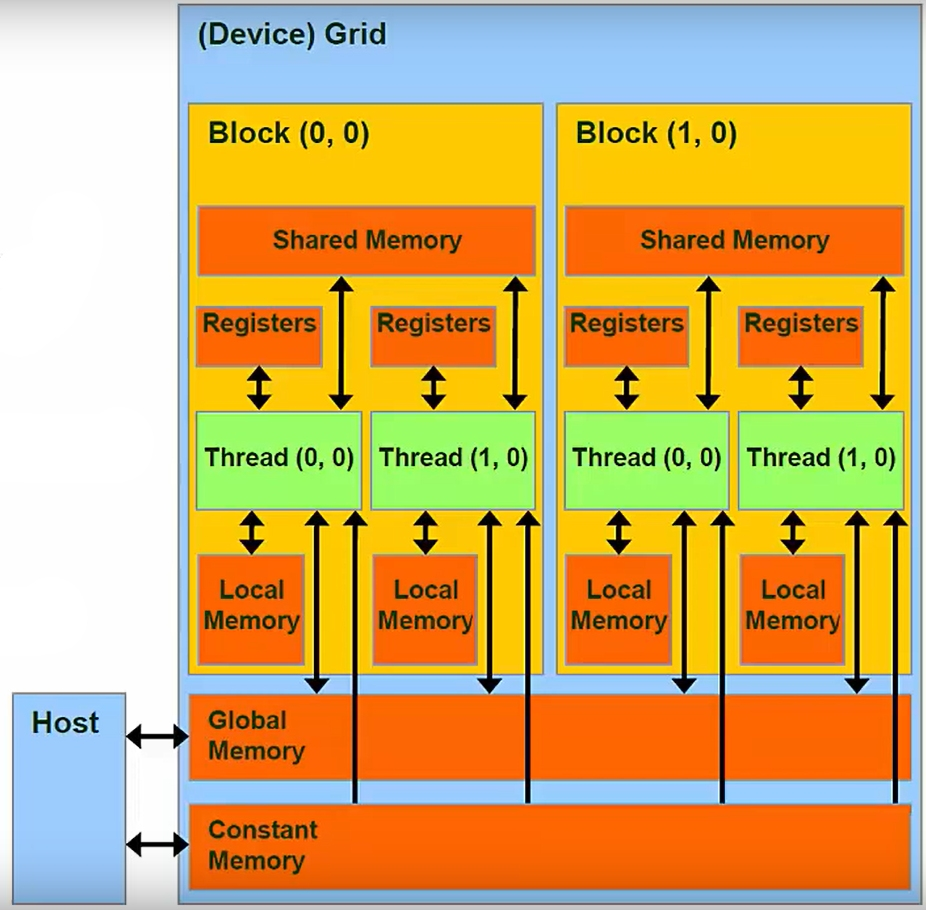

# :mortar_board: CUDA

### Concepts

##### CPU vs GPU

##### Heterogeneous System > Host / Device

A computing architecture that combines the CPU and its memory with an additional device to optimize performance by utilizing their distinct capabilities.

**Host** refers to the CPU and its on-chip memory, responsible for executing the main program and managing system operations.

**Device** typically involves a GPU, which is optimized for parallel processing and accelerates computation by handling data-intensive tasks. In a heterogeneous system, the host and device work together to enhance overall performance.


##### Threads

Threads are the smallest unit of execution in CUDA. Each thread executes a kernel, which is a function running on the GPU. Threads are designed to perform the same operation on different pieces of data, following the Single Instruction, Multiple Threads (SIMT) model.

##### Blocks

Threads are grouped into blocks. A block is a collection of threads that can cooperate with each other by sharing data through shared memory and synchronizing their execution. Blocks are executed independently, allowing for scalability across different GPU architectures.

```
+------------------+
|  Thread Block    |
|  +------------+  |
|  |  Thread 0  |  |
|  +------------+  |
|  |  Thread 1  |  |
|  +------------+  |
|  |  ...       |  |
|  +------------+  |
|  |  Thread N  |  |
|  +------------+  |
+------------------+
```

##### Grid

Blocks are further organized into a grid. A grid is a collection of blocks that execute a kernel. Each kernel launch creates a single grid, which contains all the blocks needed to execute the kernel. The grid structure allows for the execution of a large number of threads, maximizing the GPU's parallel processing capabilities.

```
+------------------+
|      Grid        |
|  +------------+  |
|  | Block 0    |  |
|  +------------+  |
|  | Block 1    |  |
|  +------------+  |
|  |  ...       |  |
|  +------------+  |
|  | Block M    |  |
|  +------------+  |
+------------------+
```

##### Execution Model

The execution model in CUDA efficiently manages the execution of threads, blocks, and grids. When a kernel is launched, the CUDA runtime system schedules the execution of blocks on the available streaming multiprocessors (SMs) of the GPU. Each SM can execute multiple blocks concurrently, depending on the resources available.

```
+------------------+
|  Streaming       |
|  Multiprocessor  |
|  +------------+  |
|  | Block 0    |  |
|  +------------+  |
|  | Block 1    |  |
|  +------------+  |
|  |  ...       |  |
|  +------------+  |
|  | Block M    |  |
|  +------------+  |
+------------------+
```
##### Memory Hierarchy

CUDA architecture includes a memory hierarchy designed to optimize data access and minimize latency. The hierarchy consists of registers, shared memory, local memory, global memory, constant memory, and host memory. Below is a compact list of each type of memory, ordered from fastest to slowest, followed by a detailed description:

- **Registers**
- **Shared Memory**
- **Constant Memory**
- **Local Memory**
- **Global Memory**
- **Host Memory (PCIe)**

```
+------------------------------------------------------------------------+
|                           Device                                       |
|                                                                        |
|  +--------------------------------------------------------+            |
|  |                   DRAM                                 |            |
|  |                                                        |            |
|  |  +-----------------------+  +-----------------------+  |            |
|  |  |      Local Memory     |  |      Global Memory    |  |            |
|  |  +-----------------------+  +-----------------------+  |            |
|  +--------------------------------------------------------+            |
|                                                                        |
|  +--------------------------------------------------------+            |
|  |                   GPU                                  |            |
|  |                                                        |            |
|  |  +-----------------------+  +-----------------------+  |            |
|  |  |   Multiprocessor      |  |   Multiprocessor      |  |            |
|  |  |  +-----------------+  |  |  +-----------------+  |  |            |
|  |  |  |   Registers     |  |  |  |   Registers     |  |  |            |
|  |  |  +-----------------+  |  |  +-----------------+  |  |            |
|  |  |  |  Shared Memory  |  |  |  |  Shared Memory  |  |  |            |
|  |  |  +-----------------+  |  |  +-----------------+  |  |            |
|  |  +-----------------------+  +-----------------------+  |            |
+------------------------------------------------------------------------+
```

- Device: Represents the entire GPU system, including both memory and processing units.
- DRAM: Contains both local and global memory, which are located off-chip. Local memory is private to each thread, while global memory is accessible by all threads.
- GPU: Contains multiple multiprocessors, each with its own on-chip memory.
- Multiprocessor: Each multiprocessor has registers and shared memory. Registers are private to each thread, while shared memory is accessible by all threads within a block.

An important observation is that local memory is significantly slower than register memory, often by hundreds of times. Variables that are too large to be stored in registers are instead placed in DRAM, which is where local memory resides. This means that accessing local memory is much slower compared to accessing registers. Therefore, it's crucial to manage variable sizes and register usage efficiently to minimize reliance on local memory and maintain optimal performance in CUDA applications.



##### Registers

Fastest memory, used for storing frequently accessed variables by individual threads.

- **Speed**: Fastest
- **Bandwidth**: ~8TB/s
- **Latency**: ~1 clock
- **Scope**: Accessible by individual threads
- **Size**: Limited size per thread
- **Usage**: Storing frequently accessed variables
- **Persistence**: Data persists only during thread execution
- **Access Pattern**: No conflicts, direct access
- **Caching**: Not cached, directly accessed by the thread
- **Location**: Located on-chip, within each streaming multiprocessor (SM)

##### Shared Memory

Faster memory shared among threads within the same block.

- **Speed**: Faster than global memory
- **Bandwidth**: ~1.5TB/s
- **Latency**: ~32 clocks
- **Scope**: Accessible by threads within a block
- **Size**: Limited size per block
- **Usage**: Storing data shared within a block
- **Persistence**: Data persists only during block execution
- **Access Pattern**: Bank conflicts can affect performance
- **Caching**: Not cached, but acts as a user-managed cache
- **Location**: Located on-chip, within each streaming multiprocessor (SM)

##### Constant Memory

Special region of device memory used for data with unchanging contents throughout kernel execution.

- **Speed**: Faster than global memory due to caching
- **Bandwidth**: Limited by cache size and access patterns
- **Latency**: Low latency when cached
- **Scope**: Read-only from the kernel, writable by the host
- **Size**: Limited to 64KB
- **Usage**: Storing read-only data that remains constant during kernel execution
- **Persistence**: Data persists across kernel launches
- **Access Pattern**: Optimized for broadcast to all threads
- **Caching**: Aggressively cached into on-chip memory
- **Location**: Located off-chip, in the GPU's DRAM, but cached on-chip

##### Local Memory

Used for storing data private to each thread, typically when registers are insufficient.

- **Speed**: Slower than registers, similar to global memory
- **Bandwidth**: ~200GB/s
- **Latency**: ~800 clocks
- **Scope**: Private to each thread
- **Size**: Limited by the available global memory
- **Usage**: Storing temporary variables and data specific to a thread's execution
- **Persistence**: Data persists only during thread execution
- **Access Pattern**: Accessed by the thread that owns it
- **Caching**: Cached in L1 cache on some architectures
- **Location**: Located off-chip, in the GPU's DRAM, but managed as part of the thread's context

##### Global Memory

Accessible by all threads, used for storing data shared across blocks.

- **Speed**: Slowest among GPU memories
- **Bandwidth**: ~200GB/s
- **Latency**: ~800 clocks
- **Scope**: Accessible by all threads
- **Size**: Largest
- **Usage**: Storing data shared across blocks
- **Persistence**: Data persists across kernel launches
- **Access Pattern**: Coalesced access improves performance
- **Caching**: Cached in L2 cache, with some architectures also supporting L1 caching
- **Location**: Located off-chip, in the GPU's DRAM

Global memory is managed using functions such as `cudaMalloc()` for allocation, `cudaMemset()` for initialization, `cudaMemcpy()` for data transfer, and `cudaFree()` for deallocation.

##### Host Memory (PCIe)

Memory located on the host system, accessed via the PCIe bus.

- **Speed**: Slowest overall
- **Bandwidth**: ~5GB/s
- **Latency**: Higher than GPU memory types, as it involves data transfer over the PCIe bus
- **Scope**: Accessible by the host and can be accessed by the GPU through data transfer
- **Size**: Limited by the host system's memory capacity
- **Usage**: Storing data that needs to be transferred to and from the GPU
- **Persistence**: Data persists across program execution
- **Access Pattern**: Accessed via data transfer operations
- **Caching**: Managed by the host system
- **Location**: Located on the host system

##### Indices in a CUDA Program

In a CUDA program, indices are used to uniquely identify threads and blocks within the grid. These indices are crucial for determining which portion of the data each thread will process. The main indices in a CUDA program are:

- **Thread Indices**: `threadIdx.x`, `threadIdx.y`, `threadIdx.z`
- **Block Indices**: `blockIdx.x`, `blockIdx.y`, `blockIdx.z`
- **Dimension Sizes**: `blockDim.x`, `blockDim.y`, `blockDim.z`, `gridDim.x`, `gridDim.y`, `gridDim.z`
- **Global Indices**: Calculated using block and thread indices

##### Thread Indices

- **`threadIdx.x`**: The x-coordinate of a thread within its block. It ranges from 0 to `blockDim.x - 1`.
- **`threadIdx.y`**: The y-coordinate of a thread within its block. It ranges from 0 to `blockDim.y - 1`.
- **`threadIdx.z`**: The z-coordinate of a thread within its block. It ranges from 0 to `blockDim.z - 1`.

These indices allow you to access the specific thread within a block, which is useful for operations that require knowledge of the thread's position within its block.

##### Block Indices

- **`blockIdx.x`**: The x-coordinate of a block within the grid. It ranges from 0 to `gridDim.x - 1`.
- **`blockIdx.y`**: The y-coordinate of a block within the grid. It ranges from 0 to `gridDim.y - 1`.
- **`blockIdx.z`**: The z-coordinate of a block within the grid. It ranges from 0 to `gridDim.z - 1`.

These indices are used to identify the specific block within the grid, which is important for determining the portion of the data that the block is responsible for processing.

##### Dimension Sizes

- **`blockDim.x`**: The number of threads in the x-dimension of a block.
- **`blockDim.y`**: The number of threads in the y-dimension of a block.
- **`blockDim.z`**: The number of threads in the z-dimension of a block.

- **`gridDim.x`**: The number of blocks in the x-dimension of the grid.
- **`gridDim.y`**: The number of blocks in the y-dimension of the grid.
- **`gridDim.z`**: The number of blocks in the z-dimension of the grid.

These dimension sizes are used to configure the execution of the kernel and to calculate the global indices of threads.

##### Global Indices

To calculate the global index of a thread, which is its unique position across the entire grid, you can use the following formulas:

- **1D Global Index**:
  ```cpp
  int globalIndex = blockIdx.x * blockDim.x + threadIdx.x;
  ```

- **2D Global Index**:
  ```cpp
  int globalIndexX = blockIdx.x * blockDim.x + threadIdx.x;
  int globalIndexY = blockIdx.y * blockDim.y + threadIdx.y;
  ```

- **3D Global Index**:
  ```cpp
  int globalIndexX = blockIdx.x * blockDim.x + threadIdx.x;
  int globalIndexY = blockIdx.y * blockDim.y + threadIdx.y;
  int globalIndexZ = blockIdx.z * blockDim.z + threadIdx.z;
  ```

These global indices are used to map each thread to a specific element in the data array, allowing for parallel processing of data.
