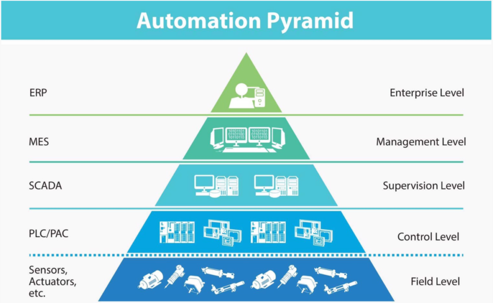
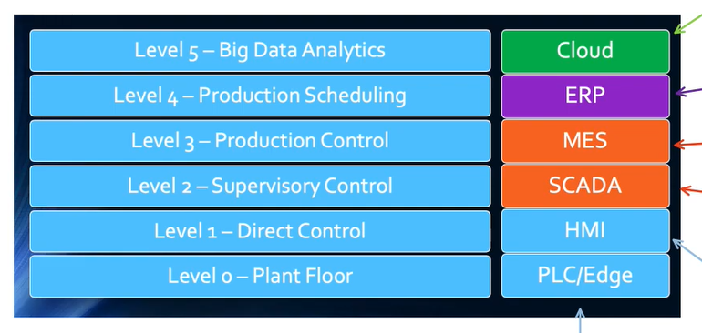

# Key concepts of Internet of Things

Key concepts of Internet of Things.

<!-- [:arrow_down: Tags legend](#tags-legend) at the end of the page. -->

<!-- -  by  ( _:movie_camera:_ ) -->

## PLC ~ Programmable Logic Controller

A **Programmable Logic Controller (PLC)** is a digital computer used for automation of industrial processes, such as control of machinery on factory assembly lines.

PLCs are designed for multiple input and output arrangements, extended temperature ranges, immunity to electrical noise, and resistance to vibration and impact. They are programmed using a specialized computer language, often ladder logic, and are used in various industries to automate tasks that require high reliability and ease of programming and process fault diagnosis.

## PLC / PAC

While both **Programmable Logic Controllers (PLC)** and **Programmable Automation Controllers (PAC)** are used for industrial automation, they differ in terms of capabilities and applications.

**PLC** is a digital computer used primarily for automating control processes in industrial environments. It is designed for high reliability, ease of programming, and process fault diagnosis, typically using ladder logic. PLCs are well-suited for discrete control applications where tasks are repetitive and require precise timing.

**PAC**, on the other hand, is a more advanced controller that combines the features of a PLC with those of a PC-based control system. PACs offer greater flexibility, scalability, and processing power, making them suitable for complex control applications that require data handling, network connectivity, and integration with other systems. They support multiple programming languages and can handle both discrete and continuous processes.

## Ladder Logic

A graphical programming language used to develop software for programmable logic controllers (PLCs).

Ladder logic is designed to resemble electrical relay logic diagrams, using symbols to represent control logic elements like switches, relays, and timers. It is widely used in industrial control applications due to its intuitive visual representation, which makes it easier for engineers and technicians to design, troubleshoot, and maintain control systems.

## SCADA ~ Supervisory Control and Data Acquisition

**Supervisory Control and Data Acquisition (SCADA)** is a system used for monitoring and controlling industrial processes and infrastructure.

SCADA systems gather real-time data from remote locations to control equipment and conditions. They are widely used in industries such as energy, water, and manufacturing to ensure efficient and safe operations. SCADA systems consist of hardware and software components, including sensors, controllers, and user interfaces, allowing operators to monitor system performance, analyze data, and make informed decisions to optimize processes.

Both **HMI** and **SCADA** coexist because SCADA systems require HMIs to provide operators with the necessary interface to interact with the data and control systems effectively. HMIs serve as the front-end component of SCADA systems, enabling users to visualize and manage the data collected and processed by SCADA, thus ensuring efficient and informed decision-making in industrial operations.

## HMI ~ Human-Machine Interface

A **Human-Machine Interface (HMI)** is a user interface or dashboard that connects a person to a machine, system, or device.

HMIs are used in various industries to allow operators to interact with and control machinery and processes. They provide visual representations of data, enable monitoring of system performance, and allow for manual input to control operations. HMIs can range from simple screens displaying data to complex, interactive touchscreens that provide detailed insights and control over industrial processes.

Both **HMI** and **SCADA** coexist because SCADA systems require HMIs to provide operators with the necessary interface to interact with the data and control systems effectively. HMIs serve as the front-end component of SCADA systems, enabling users to visualize and manage the data collected and processed by SCADA, thus ensuring efficient and informed decision-making in industrial operations.

## MES ~ Manufacturing Execution System

A **Manufacturing Execution System (MES)** is a software system that monitors, tracks, documents, and controls the process of manufacturing goods from raw materials to finished products.

MES provides real-time data and insights into production processes, helping manufacturers optimize operations, improve productivity, and ensure quality control. It acts as a bridge between enterprise resource planning (ERP) systems and the shop floor, facilitating communication and coordination across different levels of production. MES can include functionalities such as scheduling, resource management, production tracking, and performance analysis, enabling manufacturers to respond quickly to changing conditions and demands.

While both **ERP** and **MES** systems are used to enhance business operations, they focus on different aspects of an organization. ERP systems provide a broad overview of business processes, integrating various departments to improve overall efficiency and decision-making. In contrast, MES systems are specifically designed to manage and optimize manufacturing operations on the shop floor, focusing on real-time production data and process control.

## ERP ~ Enterprise Resource Planning

**Enterprise Resource Planning (ERP)** is a type of software used by organizations to manage and integrate the essential parts of their businesses.

ERP systems centralize data and processes across various departments, such as finance, human resources, supply chain, and manufacturing, into a unified system. This integration helps improve efficiency, accuracy, and decision-making by providing a comprehensive view of business operations. ERP systems often include modules for accounting, inventory management, order processing, and customer relationship management, among others, allowing organizations to streamline workflows and enhance collaboration across departments.

While both **ERP** and **MES** systems are used to enhance business operations, they focus on different aspects of an organization. ERP systems provide a broad overview of business processes, integrating various departments to improve overall efficiency and decision-making. In contrast, MES systems are specifically designed to manage and optimize manufacturing operations on the shop floor, focusing on real-time production data and process control.

## Automation Pyramid

The **Automation Pyramid** is a conceptual model that illustrates the hierarchy of systems and technologies used in industrial automation, from the physical devices at the base to the enterprise-level systems at the top.

**Enterprise Level** involves systems like **ERP** (Enterprise Resource Planning) that manage and integrate business processes across an organization.

**Management Level** includes **MES** (Manufacturing Execution Systems) that monitor and control manufacturing operations on the shop floor.

**Supervision Level** is represented by **SCADA** (Supervisory Control and Data Acquisition) systems, which provide real-time monitoring and control of industrial processes.

**Control Level** consists of **PLC** (Programmable Logic Controllers) and **PAC** (Programmable Automation Controllers), which execute control tasks and manage the operation of machinery and processes.

**Field Level** encompasses **sensors** and **actuators**, which are the physical devices that interact directly with the manufacturing environment, collecting data and executing control commands.

