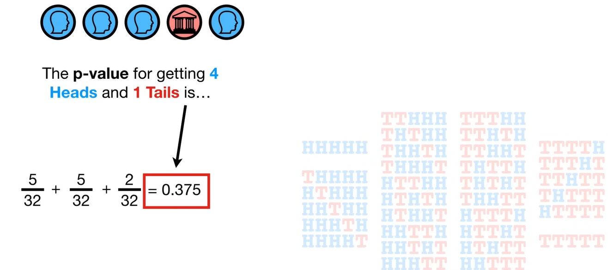

# Key concepts of Probability Theory and Satistics

Key concepts of Probability Theory and Satistics.

## Sample

A sample is a subset of individuals, items, or observations selected from a larger population for the purpose of statistical analysis. It is used to make inferences about the population without having to study the entire group.

## Null Hypothesis

Statement that assumes there is no effect or no difference in a particular situation or experiment. The null hypothesis serves as a starting point for statistical testing.

## Alternative Hypothesis

The alternative hypothesis is a statement in statistics that suggests there is an effect or a difference in a particular situation or experiment. It is the opposite of the null hypothesis and is what researchers aim to support through their analysis.

## P-Value ~ Rareness

The p-value is a statistical measure that helps determine the significance of the results obtained in a hypothesis test.

It quantifies the probability of observing the data, or something more extreme, assuming that the null hypothesis is true.

- **Purpose**: To assess the strength of the evidence against the null hypothesis.
- **Interpretation**:
  - A small p-value (typically ≤ 0.05) indicates strong evidence against the null hypothesis, leading to its rejection.
  - A large p-value (> 0.05) suggests weak evidence against the null hypothesis, so it is not rejected.
- **Significance Level**: The threshold for determining significance is usually set at 0.05, but it can vary depending on the context.

A p-value is composed of three parts:

1. The probability random chance would result in the observation.
2. The probability of observing something else that is equally rare.
3. The probability of observing something rarer or more extreme.

## Two-sided / One-sided test

One-sided tests look for effects in one direction, while two-sided tests consider both directions. Usually Two-sided P-Value is what really needed.

## Power in Statistics

Statistical power is the probability that a test will correctly reject a false null hypothesis.

It measures a test's ability to detect an effect when there is one. Power is the likelihood of avoiding a Type II error (failing to reject a false null hypothesis).

**Influencing Factors**:

  - **Sample Size**: Larger sample sizes generally increase power.
  - **Effect Size**: Larger effect sizes make it easier to detect differences, increasing power.
  - **Significance Level (α)**: Higher significance levels can increase power but also increase the risk of Type I errors.
  - **Variability**: Lower variability in data increases power.

## Effect Size

Effect size is a quantitative measure of the magnitude of a phenomenon, combining mean and standard deviation into single metric.

It provides an indication of the strength or importance of a relationship or difference observed in a study, independent of sample size.

d = (X̄₁ - X̄₂) / sₚ

Where:
- X̄₁ and X̄₂ are the means of the two groups.
- sₚ is the pooled standard deviation, calculated as:

## Sample Size for Desired Power

To calculate the sample size needed to achieve a desired statistical power, you can use the following formula, which is often used for comparing two means:

n = [(Z₁₋α/₂ + Z₁₋β)² * (σ₁² + σ₂²)] / Δ²

Where:
- n is the sample size per group.
- Z₁₋α/₂ is the Z-score corresponding to the desired significance level (α), typically 0.05 for a two-tailed test.
- Z₁₋β is the Z-score corresponding to the desired power (1 - β), typically 0.80 or 0.90.
- σ₁² and σ₂² are the variances of the two groups.
- Δ is the minimum detectable effect size (difference in means).

> Steps to Calculate Sample Size

1. **Determine the Desired Power**: Commonly set at 0.80 or 0.90.
2. **Set the Significance Level (α)**: Typically 0.05 for a two-tailed test.
3. **Estimate the Effect Size (Δ)**: The smallest difference you want to detect.
4. **Estimate the Variance (σ²)**: Based on previous studies or pilot data.
5. **Use the Formula**: Plug the values into the formula to calculate the required sample size.

Statistical software or online calculators can also be used to simplify this process and provide more accurate results.

## Covariance

Covariance is a statistical measure that indicates the extent to which two variables change together. It helps to determine whether an increase in one variable corresponds to an increase or decrease in another variable.

##### Indication

- **Positive Covariance**: Indicates that the two variables tend to increase or decrease together.
- **Negative Covariance**: Indicates that as one variable increases, the other tends to decrease.
- **Zero Covariance**: Suggests no linear relationship between the variables.

##### Formula for Covariance

The covariance between two variables X and Y is calculated using the following formula:

Cov(X, Y) = Σ((Xᵢ - X̄)(Yᵢ - Ȳ)) / (n - 1)

Where:
- Xᵢ and Yᵢ are the individual data points for variables X and Y.
- X̄ and Ȳ are the means of X and Y, respectively.
- n is the number of data points.

## Correlation

Correlation is a statistical measure that describes the strength and direction of a linear relationship between two variables.

It is a standardized form of covariance that ranges from -1 to 1.

- **Positive Correlation**: Indicates that as one variable increases, the other variable also increases.
- **Negative Correlation**: Indicates that as one variable increases, the other variable decreases.
- **Zero Correlation**: Suggests no linear relationship between the variables.

The Pearson correlation coefficient between two variables X and Y can be expressed in terms of covariance and variance:

r = Cov(X, Y) / √(Var(X) * Var(Y))

Where:
- Cov(X, Y) is the covariance between X and Y.
- Var(X) is the variance of X.
- Var(Y) is the variance of Y.

## Expected Value

The expected value is a fundamental concept in probability and statistics that represents the average or mean value of a random variable over a large number of trials.

It provides a measure of the central tendency of the probability distribution of the random variable.

For a discrete random variable X with possible values x₁, x₂, ..., xₙ and corresponding probabilities P(x₁), P(x₂), ..., P(xₙ), the expected value E(X) is calculated as:

E(X) = Σ [xᵢ * P(xᵢ)]

For a continuous random variable with probability density function f(x), the expected value is calculated as:

E(X) = ∫ x * f(x) dx

## Binomial Distribution

The binomial distribution is a discrete probability distribution that models the number of successes in a fixed number of independent and identically distributed Bernoulli trials.

Each trial has two possible outcomes: success or failure.

- **Number of Trials (n)**: The fixed number of independent trials.
- **Probability of Success (p)**: The probability of success on each trial.
- **Probability of Failure (q)**: The probability of failure on each trial, where q = 1 - p.
- **Mean (Expected Value)**: E(X) = n * p
- **Variance**: Var(X) = n * p * q

The probability of observing exactly k successes in n trials is given by the binomial probability mass function:

P(X = k) = C(n, k) * p^k * q^(n-k)

Where:
- P(X = k) is the probability of k successes.
- C(n, k) = n! / (k! * (n-k)!) is the binomial coefficient, representing the number of ways to choose k successes from n trials.
- p is the probability of success on each trial.
- q is the probability of failure on each trial.

## Central Limit Theorem

The Central Limit Theorem (CLT) is a fundamental principle in statistics that describes the behavior of the sampling distribution of the sample mean.

It states that, given a sufficiently large sample size, the distribution of the sample mean will approximate a normal distribution, regardless of the shape of the population distribution.

- **Sample Size**: The theorem holds when the sample size is large enough, typically n ≥ 30 is considered sufficient.
- **Independence**: The samples must be independent of each other.
- **Population Distribution**: The original population distribution can be of any shape (e.g., skewed, uniform, etc.).
- **Normal Approximation**: As the sample size increases, the sampling distribution of the sample mean becomes approximately normal.
- **Mean of Sampling Distribution**: The mean of the sampling distribution of the sample mean is equal to the mean of the population (μ).
- **Standard Deviation of Sampling Distribution**: The standard deviation of the sampling distribution (standard error) is equal to the population standard deviation (σ) divided by the square root of the sample size (n), i.e., σ/√n.

## Difference Between Technical and Biological Replicates

In scientific experiments, replicates are used to ensure the reliability and accuracy of results. There are two main types of replicates: technical replicates and biological replicates. Understanding the difference between them is crucial for experimental design and data interpretation.

##### Technical Replicates

- **Definition**: Technical replicates are repeated measurements of the same sample or experimental condition. They are used to assess the precision and consistency of the measurement technique or instrument.
- **Purpose**: To account for variability in the measurement process and ensure that the results are reproducible.
- **Example**: Running the same sample multiple times in a PCR machine to check for consistency in the results.

##### Biological Replicates

- **Definition**: Biological replicates are independent samples that are biologically distinct but treated under the same experimental conditions. They are used to capture the natural biological variability.
- **Purpose**: To ensure that the results are generalizable and not specific to a single biological sample.
- **Example**: Using different animals or cell cultures from the same species to test the effect of a drug.

## Effective Sample Size

The effective sample size is a concept used in statistics to account for the amount of information or precision that a sample provides, especially when the data are not independent or identically distributed.

It is particularly relevant in complex survey designs, time series data, or clustered data where observations may be correlated.

- **Purpose**: To adjust the nominal sample size to reflect the true amount of information available, considering any dependencies or correlations within the data.
- **Importance**: Provides a more accurate estimate of the sample's ability to represent the population, which is crucial for statistical inference and hypothesis testing.

The effective sample size can be calculated using different methods depending on the context. Here are a few examples:

 - Effective Sample Size (n_eff) = n / (1 + (n - 1) * ρ)
 - Where n is the nominal sample size, and ρ (rho) is the intra-cluster correlation coefficient.

## Standard Error

Standard error (SE) just a standard deviation of multiple means taken on the same population.

The standard error (SE) is a statistical measure that quantifies the amount of variability or dispersion of a sample statistic, such as the sample mean, from the true population parameter. It provides an estimate of the precision of the sample statistic as an estimate of the population parameter.

- **Purpose**: To measure the accuracy with which a sample statistic represents the population parameter.
- **Relation to Sample Size**: The standard error decreases as the sample size increases, indicating more precise estimates with larger samples.

For the sample mean, the standard error is calculated as:

SE = σ / √n

Where:
- σ is the standard deviation of the population.
- n is the sample size.

If the population standard deviation is unknown, the sample standard deviation (s) is used:

SE = s / √n

## Confidence Interval

A confidence interval (CI) is a range of values, derived from sample data, that is likely to contain the true population parameter (such as the mean or proportion) with a specified level of confidence.

It provides an estimate of the uncertainty associated with a sample statistic. If two confidence interval don't overlap it's statistically significant if does overlap then t-test is necessary.

- **Purpose**: To give an estimated range of values which is likely to include the population parameter.
- **Confidence Level**: The probability that the confidence interval contains the true parameter. Common confidence levels are 90%, 95%, and 99%.
- A 95% confidence interval means that if you were to take 100 different samples and compute a confidence interval for each sample, approximately 95 of the intervals will contain the true population mean.
- The width of the confidence interval indicates the precision of the estimate; narrower intervals suggest more precise estimates.

For a sample mean, the confidence interval is calculated as:

CI = X̄ ± Z * (SE)

Where:
- X̄ is the sample mean.
- Z is the Z-score corresponding to the desired confidence level (e.g., 1.96 for 95% confidence).
- SE is the standard error of the sample mean ( variance )
