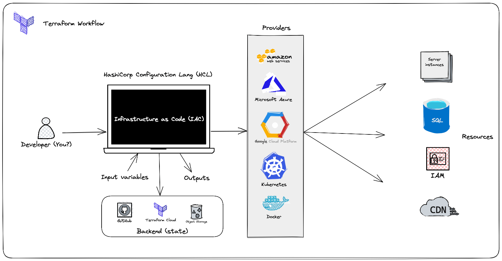

# Key concepts of Terraform

Key concepts of Terraform.

<!-- [:arrow_down: Tags legend](#tags-legend) at the end of the page. -->

## Terraform Architecture



## Terraform CLI

#### `terraform init`

Initializes a Terraform working directory, setting up necessary local data.

- `-backend=false`: Disables backend initialization.
- `-reconfigure`: Reconfigures backend, ignoring saved settings.
- `-migrate-state`: Migrates existing state during reconfiguration.
- `-upgrade`: Installs the latest module and provider versions.

#### `terraform -install-autocomplete`

Enables tab auto-completion. Requires re-login.

#### `terraform fmt`

Formats Terraform configuration files (.tf and .tfvars) to a standard format.

- `-check`: Checks if files are formatted without overwriting.
- `-recursive`: Processes files in subdirectories.

#### `terraform validate`

Checks configuration files for errors without accessing remote services.

#### `terraform providers`

Displays a tree of modules with their provider requirements.

#### `terraform plan`

Creates an execution plan without applying changes.

- `-out=path`: Saves the plan to a file.
- `-input=true`: Prompts for variable input if not set.
- `-var 'foo=bar'`: Sets a variable value.
- `-var-file=filename`: Loads variable values from a file.
- `-destroy`: Plans to destroy all managed objects.
- `-refresh-only`: Checks if remote objects match the last apply.
- `-target=resource`: Limits planning to specific resources.

#### `terraform apply`

Applies changes to infrastructure based on configuration files.

- `-auto-approve`: Skips approval prompt.
- `-replace`: Forces replacement of a resource.
- `-var 'foo=bar'`: Sets a variable value.
- `-var-file=filename`: Loads variable values from a file.
- `-parallelism=n`: Limits concurrent operations (default is 10).

Examples:
- To apply changes without approval and use a specific variable file: `terraform apply -auto-approve -var-file=web-prod.tfvars`
- To replace a specific resource: `terraform apply -replace="aws_instance.server"`

#### `terraform destroy`

Destroys managed infrastructure.

- `-auto-approve`: Skips approval prompt.
- `-target`: Limits destruction to specific resources.

Example: To destroy a specific VPC without approval: `terraform destroy -target aws_vpc.my_vpc -auto-approve`

#### `terraform state`

Manages Terraform state.

- `list`: Lists resources in the state.
- `show`: Displays a resource in the state.
- `mv`: Moves an item in the state.
- `rm`: Removes instances from the state.
- `pull`: Outputs the current state.

Examples:
- To show details of a specific instance: `terraform state show aws_instance.my_vm`
- To pull the current state to a file: `terraform state pull my_terraform.tfstate`
- To move a role in the state: `terraform state mv aws_iam_role.my_ssm_role`
- To list all resources: `terraform state list`
- To remove a specific instance: `terraform state rm aws_instance.my_server`

#### `terraform refresh`

Updates the state file with current metadata without modifying infrastructure.

#### `terraform taint`

Marks a resource as needing replacement.

#### `terraform untaint`

Removes the taint from a resource, marking it as functional.

#### `terraform import`

Imports existing infrastructure into Terraform state.

Example: To import an EC2 instance with a specific ID: `terraform import aws_instance.new_server i-123abc`

#### `terraform workspace`

Manages workspaces.

- `delete`: Deletes a workspace.
- `list`: Lists workspaces.
- `new`: Creates a new workspace.
- `select`: Selects a workspace.
- `show`: Displays the current workspace name.

#### `terraform output`

Displays output variables from the state file.

Examples:
- To list all outputs in JSON format: `terraform output -json`
- To display a specific output value: `terraform output instance_public_ip`

#### `terraform graph`

Generates a dependency graph in DOT format.

Linux Example:
- To install Graphviz and generate a PNG graph:
  ```bash
  sudo apt install graphviz
  terraform graph | dot -Tpng graph.png
  ```

#### `terraform login [hostname]`

Retrieves and saves an authentication token for the specified hostname.

#### `terraform logout [hostname]`

Removes stored credentials for the specified hostname.

#### `terraform version`

Displays the version of Terraform and all installed plugins.

## Terraform Providers (Plugins)

A provider is a Terraform plugin that allows users to manage an external API.

A provider usually provides resources to manage a cloud or infrastructure platform, such as AWS or Azure, or technology (for example Kubernetes).

There are providers for Infrastructure as a Service (IaaS), Platform as a Service (PaaS), and Software as a Service (SaaS).

```terraform
terraform {
  required_providers {
    aws = {                      # provider local name
      source  = "hashicorp/aws"  # global and unique source address
      version = "~3.0"           # version constraint
    }
  }
}

# Configure the AWS Provider
provider "aws" {
  region = "us-central-1" # provider configuration options
}
```

## Managed Resources

Resources are the core elements in Terraform, representing infrastructure objects to manage. Each resource is identified by a unique combination of its **type** and **local name** within a module, such as `aws_vpc.main`.

```terraform
resource "<provider>_<resource_type>" "local_name" {
  argument1 = value
  argument2 = value
  ...
}

# Example:
resource "aws_vpc" "primary" {
  cidr_block = "192.168.1.0/24"
  enable_dns_support = true

  tags = {
    "Name" = "Primary VPC"
  }
}
```

## Unmanaged resource ~ Datasource

Data sources in Terraform allow you to access information defined outside of Terraform, from other configurations, or modified by functions. Unlike managed resources, which Terraform creates, updates, and deletes, data sources only read existing objects.

```terraform
# Output the content of a local file
output "os_version" {
  value = data.local_file.os.content
}

# Define a data source to read a local file
data "local_file" "os" {
  filename = "/etc/os-release"
}
```

## Lifecycle

lifecycle is a nested block that can appear within a resource block. The lifecycle block and its contents are meta-arguments, available for all resource blocks regardless of type.

```terraform
resource "aws_instance" "example" {
  instance_type = "t2.micro"
  ami           = "ami-abc123"

  lifecycle {

    # first create new resource then destroy old
    create_before_destroy = true

    #  This meta-argument, when set to true, will cause Terraform to reject with an error any plan that would destroy the infrastructure object associated with the resource, as long as the argument remains present in the configuration.
    prevent_destroy = true,

    # By default, Terraform detects any difference in the current settings of a real infrastructure object and plans to update the remote object to match configuration.
    ignore_changes = [
      # Ignore changes to tags, e.g. because a management agent
      # updates these based on some ruleset managed elsewhere.
      tags,
    ]

    replace_triggered_by = [
      # Replace `aws_appautoscaling_target` each time this instance of
      # the `aws_ecs_service` is replaced.
      aws_ecs_service.svc.id
    ]

    # The AMI ID must refer to an AMI that contains an operating system
    # for the `x86_64` architecture.
    precondition {
      condition     = data.aws_ami.example.architecture == "x86_64"
      error_message = "The selected AMI must be for the x86_64 architecture."
    }

  }
}
```

## Terraform Variables

Input variables allow customization of Terraform configurations without hard-coding values.

Variables can be declared anywhere in configuration files, but it's best practice to place them in a **variables.tf** file.

```terraform
# Variable declaration
variable "subnet_cidr_block" {
  description = "CIDR block for the subnet"
  default     = "10.0.1.0/24"
  type        = string
}
```

## Assigning Variable Values

1. Use the **default** argument in the variable block.
2. Define in a **terraform.tfvars** file. Example: `subnet_cidr_block = "10.0.2.0/24"`
3. Use the **-var** option in the command line. Example: `terraform apply -var="subnet_cidr_block=10.0.3.0/24"`
4. Use the **-var-file** option. Example: `terraform apply -var-file=prod.tfvars`
5. Set as an environment variable. Example: `export TF_VAR_subnet_cidr_block="10.0.4.0/24"`

## Variable Precedence

1. Command-line options **-var** and **-var-file**.
2. **terraform.tfvars** file.
3. Environment variables with **TF_VAR** prefix.

## String Interpolation

Interpolate values in strings using `${}`, like `${var.subnet_cidr_block}`. This allows referencing variables, resource attributes, and functions. Escape interpolation with `$$`, e.g., `$${foo}` renders as `${foo}`.

## Variable Types

1. **Simple Types**
   - number
   - string
   - bool
   - null

2. **Complex Types**
   - Collection Types
     - list
     - map
     - set
   - Structural Types
     - tuple
     - object

## Number Type

Defines a numeric variable.

```terraform
variable "max_connections" {
  description = "Maximum number of connections"
  default     = 100
  type        = number
}
```

## String Type

Defines a string variable.

```terraform
variable "project_name" {
  description = "Name of the project"
  type        = string
  default     = "MyProject"
}
```

## Boolean Type

Defines a boolean variable.

```terraform
variable "enable_logging" {
  description = "Enable logging feature"
  type        = bool
  default     = false
}
```

## List Type (of Strings)

Defines a list of strings.

```terraform
variable "supported_languages" {
  description = "Supported languages"
  type        = list(string)
  default     = ["English", "Spanish", "French"]
}
```

## Map Type

Defines a map of strings.

```terraform
variable "region_amis" {
  type    = map(string)
  default = {
    "us-east-1" = "ami-12345678",
    "us-west-2" = "ami-87654321"
  }
}
```

## Tuple Type

Defines a tuple with mixed types.

```terraform
variable "server_config" {
  type    = tuple([string, number, bool])
  default = ["m5.large", 2, false]
}
```

## Object Type

Defines an object with specific attributes.

```terraform
variable "firewall_rule" {
  type = object({
    from_port   = number
    to_port     = number
    protocol    = string
    cidr_blocks = list(string)
  })
  default = {
    from_port   = 22,
    to_port     = 22,
    protocol    = "tcp",
    cidr_blocks = ["0.0.0.0/0"]
  }
}
```

## Data Sources

Data sources in Terraform allow you to retrieve information about resources outside of Terraform's management, such as the public IP of an EC2 instance. Each **data block** specifies a data source (e.g., **"aws_ami"**) and assigns it a local name (e.g., **"ubuntu"**), which must be unique within a module. The block body contains query constraints.

```terraform
data "aws_ami" "ubuntu" {
  most_recent = true
  owners      = ["self"]
  tags = {
    Name   = "web-server"
    Tested = "true"
  }
}
```

## Output Values

**Output values** display information about your infrastructure and can be used by other Terraform configurations.

Use an **output block** to declare each output value. The label after the output keyword is the name.

```terraform
output "server_ip" {
  value = aws_instance.web.private_ip
}
```

## Looping Constructs

Terraform provides several looping constructs for different scenarios:

- **count**: Loop over resources.
- **for_each**: Loop over resources and inline blocks.
- **for** expressions: Loop over lists and maps.

## Count

The **count** meta-argument is used to manage multiple similar resources. It can be applied to any resource type or module.

```terraform
# Create multiple EC2 instances
resource "aws_instance" "web" {
  ami           = "ami-12345678"
  instance_type = "t2.micro"
  count         = 3  # Creates 3 instances
}
```

```terraform

variable "users" {
    type = list(string)
    default = [ "/root/user1", "/root/user2", "/root/user3", "/root/user1" ]
}

variable "content" {
    default = "password: abc"
}

resource "local_sensitive_file" "name" {
  filename = var.users[count.index]
  content = var.content
  count = length(var.users)
}

```

In blocks with count, **count.index** provides the index number (starting at 0) for the current object.

## For_Each

**for_each** is used to duplicate resources that require different configurations. It is more flexible than count when resources need distinct values.

```terraform
# Declare a variable
variable "usernames" {
  type    = list(string)
  default = ["user1", "admin", "guest"]
}

# Create IAM users
resource "aws_iam_user" "user" {
  for_each = toset(var.usernames)  # Convert list to set
  name     = each.key
}
```

```terraform

variable "users" {
    type = list(string)
    default = [ "/root/user1", "/root/user2", "/root/user3", "/root/user1" ]
}

variable "content" {
    default = "password: abc"
}

resource "local_sensitive_file" "name" {
    filename = each.value
    content = var.content
    for_each = toset( var.users )
}


```

## For Expressions

A **for** expression transforms a complex type into another complex type.

```terraform
variable "names" {
  type    = list
  default = ["alice", "bob", "charlie"]
}

output "uppercase_names" {
  value = [for n in var.names : upper(n)]
}

output "filtered_names" {
  value = [for name in var.names : upper(name) if length(name) > 3]
}
```

Running `terraform apply -auto-approve` will produce:

```terraform
Outputs:

filtered_names = [
  "ALICE",
  "CHARLIE",
]

uppercase_names = [
  "ALICE",
  "BOB",
  "CHARLIE",
]
```

## Splat Expressions

A **splat** expression offers a concise way to perform operations that could be done with a for expression.

```terraform
# Launch multiple EC2 instances
resource "aws_instance" "web" {
  ami           = "ami-87654321"
  instance_type = "t2.micro"
  count         = 3
}

output "private_ips" {
  value = aws_instance.web[*].private_ip  # Splat expression
}
```

## Dynamic Blocks

Dynamic blocks in Terraform generate nested blocks by iterating over a complex value. They are used within **resource**, **data**, **provider**, and **provisioner** blocks to create multiple nested configurations.

```terraform
# Define a list variable
variable "ingress_ports" {
  description = "List of ingress ports"
  type        = list(number)
  default     = [22, 80, 443]
}

resource "aws_security_group" "web_sg" {
  vpc_id = aws_vpc.main.id

  # Use dynamic blocks to create ingress rules
  dynamic "ingress" {
    for_each = var.ingress_ports
    iterator = port
    content {
      from_port   = port.value
      to_port     = port.value
      protocol    = "tcp"
      cidr_blocks = ["0.0.0.0/0"]
    }
  }
}
```

## Conditional Expressions

Conditional expressions in Terraform select one of two values based on a boolean condition. The syntax is `condition ? true_val : false_val`.

```terraform
variable "is_production" {
  type    = bool
  default = false
}

# Create an instance based on the environment
resource "aws_instance" "app_server" {
  ami           = "ami-12345678"
  instance_type = var.is_production ? "t2.large" : "t2.micro"  # Conditional expression
}
```

## Terraform Locals

**Local values** in Terraform are named values used within a module. They are calculated within the configuration and do not change between runs.

```terraform
locals {
  owner       = "DevOps Team"
  project     = "E-commerce Platform"
  cidr_blocks = ["10.0.1.0/24", "10.0.2.0/24"]
  tags        = {
    Name        = "dev"
    Environment = "development"
  }
}

# Create a VPC with local tags
resource "aws_vpc" "dev_vpc" {
  cidr_block = "10.0.0.0/16"
  tags       = local.tags
}

# Create a subnet using local CIDR blocks
resource "aws_subnet" "dev_subnet" {
  vpc_id     = aws_vpc.dev_vpc.id
  cidr_block = local.cidr_blocks[0]
  tags       = local.tags
}
```

Note: Local values are defined in a `locals` block but referenced as `local.<name>`.

## Built-in Functions

Terraform provides **built-in functions** for transforming and combining values. These include functions for numbers, strings, collections, and more. User-defined functions are not supported.

Examples:

```terraform
max(5, 12, 9)  # Returns 12
min(12, 54, 3)  # Returns 3
format("There are %d servers", 3)  # Returns "There are 3 servers"
join(", ", ["apple", "banana", "cherry"])  # Returns "apple, banana, cherry"
split(",", "apple,banana,cherry")  # Returns ["apple", "banana", "cherry"]
replace("hello world", "world", "Terraform")  # Returns "hello Terraform"
substr("hello world", 1, 4)  # Returns "ello"
element(["x", "y", "z"], 1)  # Returns "y"
lookup({a="alpha", b="beta"}, "a", "unknown")  # Returns "alpha"
slice(["x", "y", "z", "w"], 1, 3)  # Returns ["y", "z"]
timestamp()  # Returns current timestamp
formatdate("DD MMM YYYY", "2022-01-02T23:12:01Z")  # Returns "02 Jan 2022"
cidrhost("192.168.1.0/24", 5)  # Returns "192.168.1.5"
```

You can experiment with these functions using the `terraform console`.

## Backends

Terraform uses backends to define how operations are executed and where the state is stored. The default is a local backend, storing state as a file in the current directory. Backends must be initialized with `terraform init`. To switch backends, use `terraform init -migrate-state`.

## Types of Backends

- **Local Backend**: Stores state in a local JSON file.
- **Remote Backends**: Store state remotely, offering features like remote operations, state locking, encryption, and versioning. Examples include AzureRM, Consul, GCS, Amazon S3, and Terraform Cloud.

## Configure Remote State on Amazon S3

1. Create an S3 bucket in the AWS console.
2. Configure Terraform to use the S3 bucket for remote state.

```terraform
terraform {
  backend "s3" {
    bucket     = "my-bucket"
    key        = "terraform/state.tfstate"
    region     = "us-west-2"
    access_key = "YOUR_ACCESS_KEY"
    secret_key = "YOUR_SECRET_KEY"
  }
}
```

3. Run `terraform init` to initialize the backend.

## Configure Remote State on Terraform Cloud

1. Sign up for a Terraform Cloud account.
2. Create or join an organization.
3. Configure Terraform to use Terraform Cloud.

```terraform
terraform {
  required_providers {
    aws = {
      source  = "hashicorp/aws"
      version = "~> 3.0"
    }
  }
  cloud {
    organization = "my-organization"
    workspaces {
      name = "production"
    }
  }
}
```

4. Authenticate with Terraform Cloud using `terraform login`.
5. Run `terraform init` to initialize the backend.

## Terraform Modules

Modules in Terraform help you reuse code and adhere to the **DRY principle** ("Don't Repeat Yourself"). They organize, encapsulate, and ensure best practices in configuration.

- **Local Modules**: Stored locally, referenced with `./` or `../`.
- **Remote Modules**: Stored externally, support versioning, and can be found on the [Terraform Registry](https://registry.terraform.io/).

A module is a set of configuration files in a directory. The directory where you run Terraform commands is the root module. Modules imported into the root module are **child modules**.

```terraform
module "my_ec2" {
  source        = "../modules/ec2"
  ami_id        = var.ami_id
  instance_type = var.instance_type
  servers       = var.servers
}
```

It's best to build infrastructure as reusable modules and share them with your team. After modifying modules, run `terraform init` to update them.

## Logging

Terraform logging is controlled by the **TF_LOG** environment variable, which can be set to TRACE, DEBUG, INFO, WARN, or ERROR. Logs can be saved to a file using **TF_LOG_PATH**.

Example:

```bash
export TF_LOG_PATH=terraform.log
terraform apply
```

Separate logs can be generated for the core application and providers using **TF_LOG_CORE** and **TF_LOG_PROVIDER**.
